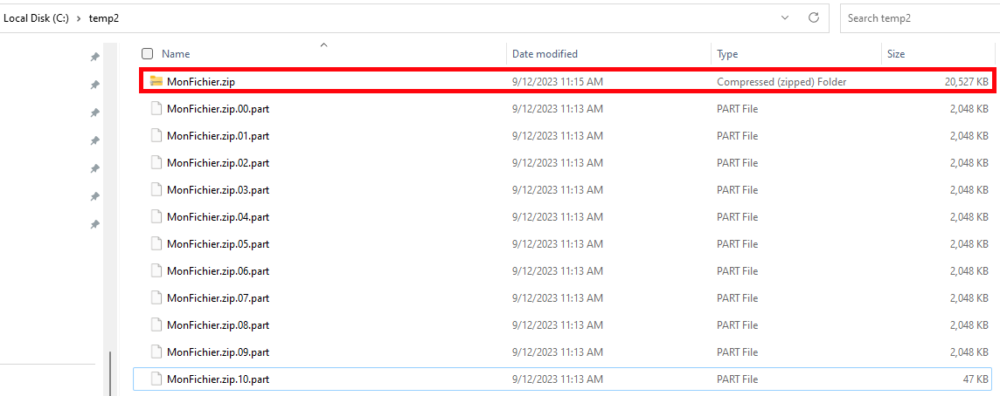

# Split / Join file functions

There are 2 functions in this sample. You can either dot source the Split/Join ps1, or copy/paste the Split/Join functions into your own scripts.
The Split function will split a file into chunks of a specified size. The Join function will join the chunks back into the original file.

Utilization example:

## Split file

I have a 20MB fichier in my C:\temp directory that I want to split into 2MB chunks:


I will run the below (you need the Split function to be either loaded from dotsourcing or copied/pasted in your script):

```powershell
Split -Path "C:\Temp\MonFichier.Zip" -ChunkSize 2MB
```

The result will be 10 files in the same directory:


## Join file

To join file back, you need to specity the initial file name (like ```MonFichier.zip```), and the file will be joined in the same directory as the splitted files (FileName.<extention>.<Number>.part).

> Note: the splitted files can be copied in any directory, just make sure to specify the path to the original name of the file.

```powershell
Join -Path c:\temp2\MonFichier.zip
```

And you will retrieve the join file in the same directory (first file in the below screenshot, also note the ```c:\temp2``` directory):



## Scenario Example

Here is a scenario example of how to use the Split/Join functions to split a compressed file, send the pieces, join the pieces back, and expand the compressed file.

<details>
<summary>1- Compress your file(s) using [Compress-Archive](https://learn.microsoft.com/en-us/powershell/module/microsoft.powershell.archive/compress-archive?view=powershell-7.3)</summary><br>

```powershell
Compress-Archive -Path "C:\Reference\Draftdoc.docx", "C:\Reference\Images\*.vsd" -CompressionLevel "Fastest" -DestinationPath "C:\Temp\MonFichier.zip"
```

Link: [Compress-Archive documentation](https://learn.microsoft.com/en-us/powershell/module/microsoft.powershell.archive/compress-archive?view=powershell-7.3)

Or just use Windows compress in the Windows Explorer, or WinZip, or 7Zip, or whatever you want.
</details><br>

<details>
<summary>2- Split your archive with the "Split" function</summary><br>

```powershell
Split -Path "C:\Temp\MonFichier.Zip" -ChunkSize 2MB
```
</details><br>

<details>
<summary>3- Send/Transfer the pieces</summary><br>

</details><br>

<details>
<summary>4- Join the pieces with the "Join" function</summary>
<br>

```powershell
Join -Path c:\temp2\MonFichier.zip
```
</details>
<br>

<details>
<summary>5- Expand the archive with Expand-Archive cmdlet or just use Windows Explorer, WinZip, 7Zip, or whatever you want to expand the archive.</summary>
<br>

```powershell
Expand-Archive -Path c:\temp2\MonFichier.zip -DestinationPath c:\temp3
```

Link: [Expand-Archive documentation](https://docs.microsoft.com/en-us/powershell/module/microsoft.powershell.archive/expand-archive?view=powershell-7.1)

</details>